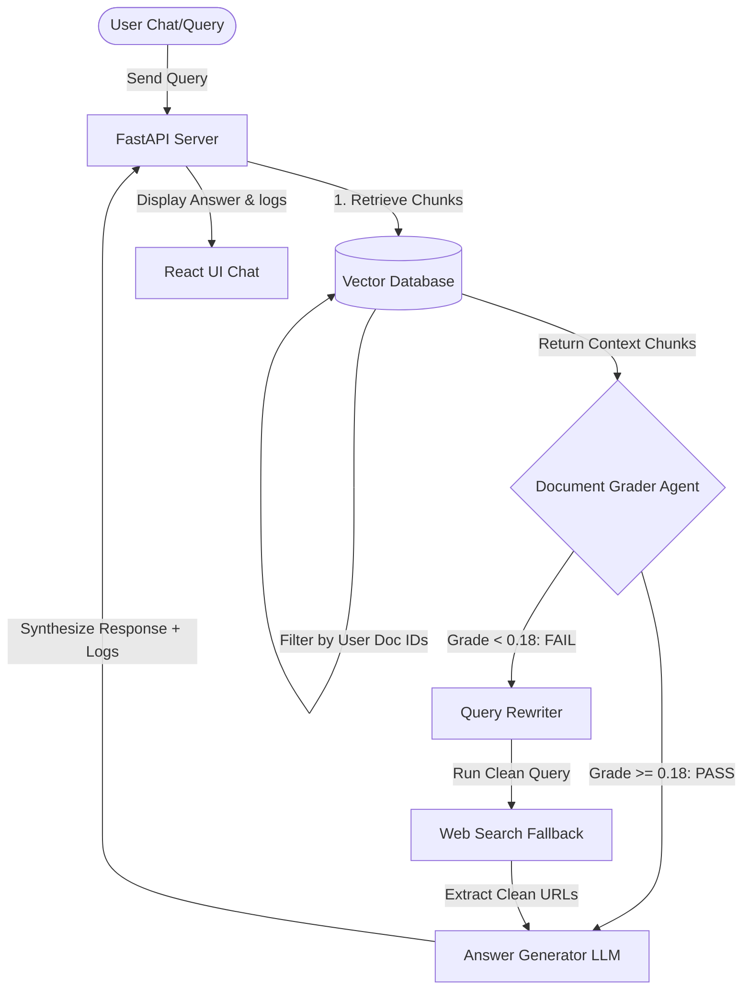

# ⚡ Corrective Retrieval-Augmented Generation (CRAG) Platform

An agentic, factual-first Question-Answering platform that utilizes **Corrective RAG (CRAG)** to evaluate retrieved documents, perform query rewriting, and trigger web search fallbacks to deliver highly accurate answers without hallucinations.

Built with a **FastAPI backend** (Python), a **React (Vite) frontend**, and styled with a **sleek obsidian dark glassmorphism UI**.

---

## 🚀 Key Features

*   **📂 Multi-format File Ingestion:** Upload PDF, TXT, or MD files. Documents are dynamically chunked, embedded locally (`all-MiniLM-L6-v2`), and indexed inside a secure vector store.
*   **🔒 Strict Multi-Tenant Data Isolation:** Vector searches are securely isolated at the database query layer, ensuring users can only retrieve and query their own uploaded documents.
*   **🧠 Intelligent Agentic Evaluator:** Automatically grades retrieved passages using cosine similarity.
*   **🔍 Corrective Web Search Fallback:** If local documents fail to meet the relevance threshold, the system reformulates the query, executes a real-time DuckDuckGo web search, and synthesizes answers using consolidated sources.
*   **💬 Premium Chat UI:** Interactive obsidian glassmorphism messaging layout with fluid micro-animations, copyable code blocks, and markdown support.
*   **🪵 Live CRAG Pipeline Logs:** A togglable log drawer displaying real-time agent execution stages (`RETRIEVAL` → `EVALUATION` → `DECISION` → `QUERY_REWRITE` → `WEB_SEARCH` → `GENERATION`).
*   **🔌 Multi-LLM Support:** Native compatibility with **Groq** (`llama-3.3-70b-versatile`), **Gemini** (`gemini-1.5-flash`), and **OpenAI** (`gpt-4o-mini`). Includes a local rule-based heuristics fallback.

---

## 🛠️ Architecture Workflow



---

## ⚙️ Environment Configurations

Create a `.env` file in the `backend/` directory to configure your preferred LLM provider:

```env
# JWT Secret for session authentication
JWT_SECRET=super-secret-key-crag-platform

# API Keys (Configure at least one to enable LLM generation)
GROQ_API_KEY=gsk_your_groq_api_key_here
GEMINI_API_KEY=
OPENAI_API_KEY=
```

---

## 📦 Quick Start with Docker (Recommended)

To run the entire fullstack platform in production mode with a single command:

1.  **Clone this repository and navigate to the project directory:**
    ```bash
    git clone <your-repo-url>
    cd crag
    ```
2.  **Spin up the container:**
    ```bash
    docker-compose up --build -d
    ```
3.  **Access the application:**
    *   **Frontend & API:** `http://localhost:8000`

---

## 🔧 Local Development Setup

If you prefer to run the client and server separately for development:

### 1. Backend Server Setup
1.  Navigate to the backend folder:
    ```bash
    cd backend
    ```
2.  Create and activate a virtual environment:
    ```bash
    python -m venv venv
    # Windows:
    .\venv\Scripts\Activate.ps1
    # Mac/Linux:
    source venv/bin/activate
    ```
3.  Install dependencies:
    ```bash
    pip install -r requirements.txt
    ```
4.  Start development server:
    ```bash
    uvicorn app.main:app --reload
    ```
    *   **Dev server:** `http://127.0.0.1:8000`
    *   **API Documentation:** `http://127.0.0.1:8000/docs`

### 2. Frontend Client Setup
1.  Navigate to the frontend folder:
    ```bash
    cd ../frontend
    ```
2.  Install packages:
    ```bash
    npm install
    ```
3.  Start development client:
    ```bash
    npm run dev
    ```
    *   **Client interface:** `http://localhost:5173`

---

## 🌐 Public Deployment Guide

This app is production-ready and can be deployed publicly in two ways:

### Option A: Unified Docker Deployment (Recommended)
You can deploy the Docker container to platforms like **Render**, **Railway**, or **Fly.io**:
1.  Connect your GitHub repository to the platform.
2.  Select **Web Service** and choose **Dockerfile** as the build mechanism.
3.  Mount a persistent disk/volume at `/app/storage` to persist SQLite databases and uploaded PDFs.
4.  Define `GROQ_API_KEY` (and other keys) in the environment variables settings.

### Option B: Separate Frontend (Vercel) & Backend (Render/Railway)
1.  Deploy the static frontend from `frontend/` to **Vercel**. Configure the backend API endpoint URL as an environment variable proxy.
2.  Deploy the FastAPI server from `backend/` to a persistent hosting provider like **Render** or **Railway**.
