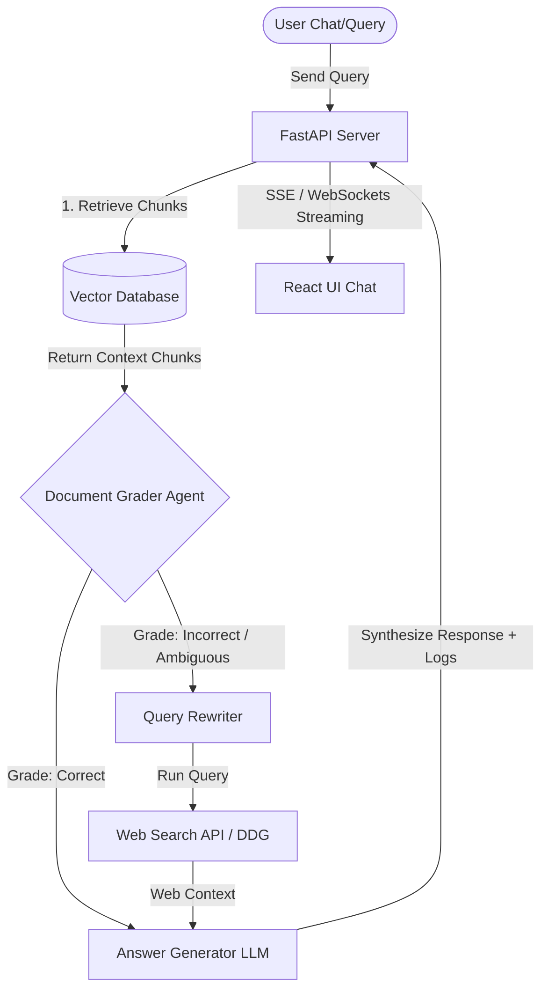

# Technical Architecture Document

## 1. System Overview

The Corrective RAG (CRAG) Platform consists of a FastAPI backend and a React (Vite) frontend. The core system architecture follows an agentic design pattern where retrieved documents are evaluated, query correction is performed, and web searches are triggered when needed.

### Core Architecture Flow Diagram



---

## 2. Recommended Tech Stack

| Layer | Technology | Rationale |
|---|---|---|
| **Frontend** | React (Vite, Javascript) | Extremely fast development, hot-reloading, clean folder structure, modular components. |
| **Styling** | Vanilla CSS | Perfect control over custom glassmorphic styling, animations, and typography without bloated framework config. |
| **Backend** | Python (FastAPI) | Asynchronous support, clean OpenAPI docs, native integration with machine learning and RAG tooling. |
| **Database** | SQLite + FAISS / ChromaDB | Lightweight, zero-configuration local databases perfect for running the app out-of-the-box. |
| **LLM & Tooling** | LangChain / Custom Python CRAG Agents | Clean pipelines for grading, query rewriting, and LLM text generation. |
| **Search Fallback**| DuckDuckGo Search Client | Free, no API key required, highly reliable for real-time fallback results. |

---

## 3. Project Structure

```text
c:\Users\Al hafiz computers\Desktop\crag\
├── docs/                               # Project documentation
│   ├── PRD.md
│   ├── TECHNICAL_ARCHITECTURE.md
│   ├── SECURITY_ACCESS.md
│   ├── FRONTEND_SPECIFICATION.md
│   └── FEATURE_TICKETS.md
├── backend/                            # FastAPI Server
│   ├── app/
│   │   ├── core/                       # Configurations and DB client setup
│   │   ├── models/                     # SQLite ORM models
│   │   ├── routers/                    # Endpoint routers (chat, docs, auth)
│   │   ├── services/                   # Business logic (CRAG agents, parsing, embedding)
│   │   └── main.py                     # Entry point
│   ├── requirements.txt
│   └── database.db
├── frontend/                           # React SPA
│   ├── src/
│   │   ├── components/                 # Reusable UI elements (Chat, Visualizer)
│   │   ├── styles/                     # Vanilla CSS modules
│   │   ├── App.jsx
│   │   └── main.jsx
│   ├── package.json
│   └── vite.config.js
└── README.md
```

---

## 4. Database Design

We will use an SQLite database to store user sessions, uploaded document metadata, and chat history. Vector embeddings will be managed by a local FAISS or lightweight python vector index.

### Tables
- **Users**: Local credentials storage.
- **Documents**: Uploaded file metadata.
- **Conversations**: Chat session metadata.
- **Messages**: Individual user messages, system responses, and CRAG logs.

```text
[users] 1 ---- * [documents]
[users] 1 ---- * [conversations] 1 ---- * [messages]
```

---

## 5. API Design

| Endpoint | Method | Description | Auth |
|---|---|---|---|
| `/api/auth/register` | `POST` | User registration | No |
| `/api/auth/login` | `POST` | Get JWT token | No |
| `/api/documents` | `GET` | List uploaded files | Yes |
| `/api/documents/upload`| `POST` | Upload PDF/TXT files | Yes |
| `/api/chat/stream` | `GET/POST`| Stream query answer & CRAG logs (SSE) | Yes |
| `/api/chat/sessions` | `GET` | Get user chat sessions | Yes |

---

## 6. Environment Variables

```env
PORT=8000
JWT_SECRET=super-secret-key-crag-platform
OPENAI_API_KEY=your-openai-api-key # Optional fallback to local models or other APIs
TAVILY_API_KEY=optional-key-for-search
```

---

## 7. Security Architecture
- **JWT tokens** sent via `Authorization: Bearer <token>` headers.
- **Strict CORS** policies limiting requests to the designated frontend origin.
- Local document parsing is sanitized to prevent file upload vulnerability / execution payload injection.

---

## 8. Scalability Strategy
- Clean isolation of the agent logic allows upgrading the local vector store (FAISS) to a managed cloud database (e.g., Qdrant, Pinecone) with minimal changes.
- Streaming responses using FastAPI `StreamingResponse` (Server-Sent Events) reduces time-to-first-token latency.
